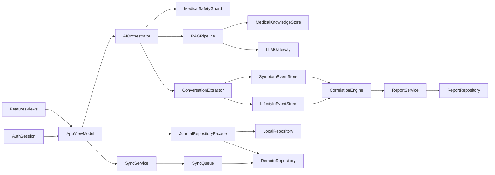
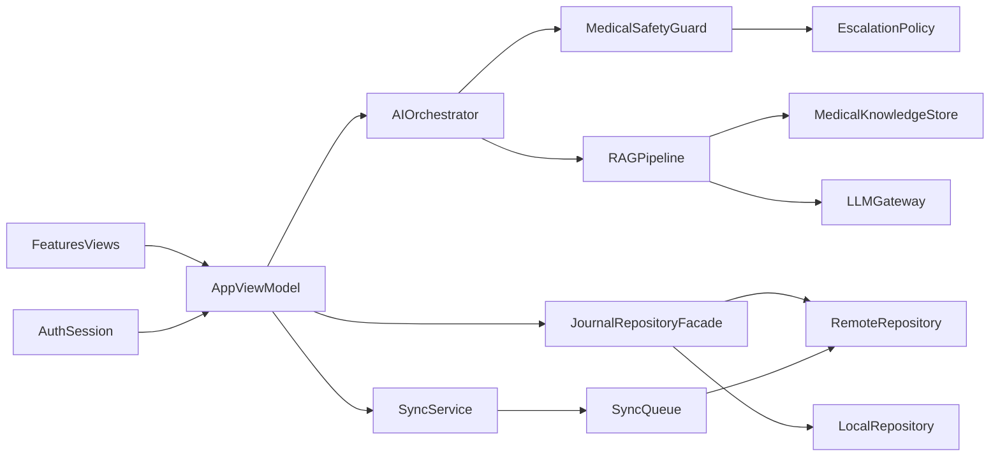
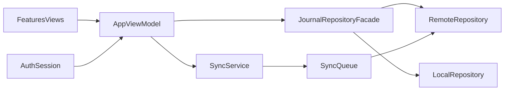

# 潮安下一阶段执行计划（医疗场景可用版）

## 目标（8-12周）

- 建立“可靠对话 + 可追溯证据 + 安全防线”的医疗级 AI 能力。
- 把用户对话自动转成结构化健康数据（症状、诱因、生活方式），并纳入报告体系。
- 完成“本地 -> 云端”数据升级（账号、同步、冲突、迁移）并与 AI 服务联动。
- 把上线标准从“功能可用”提升为“安全可控 + 审计可追踪 + 可持续运营”。

## 现有基础（可复用）

- 已有分层骨架：`App/Core/Domain/Data/Features`（见 [Architecture-Guide.md](/Users/jiayinghe/Desktop/潮安/Architecture-Guide.md)）。
- 已有仓库抽象与用例：`JournalRepositoryProtocol`、`ExtractSignalsUseCase`（见 [潮安/Domain/Repositories/JournalRepositoryProtocol.swift](/Users/jiayinghe/Desktop/潮安/潮安/Domain/Repositories/JournalRepositoryProtocol.swift), [潮安/Domain/UseCases/ExtractSignalsUseCase.swift](/Users/jiayinghe/Desktop/潮安/潮安/Domain/UseCases/ExtractSignalsUseCase.swift)）。
- 已有 App 状态管理：`AppViewModel`（见 [潮安/App/AppState.swift](/Users/jiayinghe/Desktop/潮安/潮安/App/AppState.swift)）。

## 目标架构增量（新增医疗 AI 与分析层）

## 医疗可靠性原则（先定死）

- 不给“诊断结论”与“处方级建议”，只做健康教育与自我管理支持。
- 回答必须可追溯：优先返回知识依据（来源ID、版本、更新时间）。
- 高风险问题（如严重胸痛、极端情绪、异常出血）强制转就医，不给延迟性建议。
- 模型是生成层，不是事实源；事实源来自受控知识库。
- 对话分析结果必须标注置信度与证据来源，低置信度不写入关键结论。（例如论文必须来源于2010年后，IF越高排在越前）

## 新增关键能力：对话分析与报告写回

### 1) 对话内容结构化提取

- 从用户对话提取：
  - 症状事件（症状名、强度、出现时段、持续时间）
  - 生活方式事件（睡眠、饮食、运动、咖啡因、压力、情绪）
  - 触发因素候选（如辛辣饮食、晚间咖啡、高压会议）
- 每条提取结果保留：来源消息ID、时间戳、提取器版本、置信度。

### 2) 症状与生活方式相关性分析

- 构建按时间窗口的分析（7/30/90 天）：
  - 共现频次（symptom-lifestyle pair）
  - 滞后相关（前一日/前两日生活方式对次日症状影响）
  - 个体化趋势（同用户历史变化，不与群体混淆）
- 输出为“建议级结论”而非“医学因果结论”，并附解释文本。

### 3) 报告写回

- 分析结果写入报告域：
  - 高风险信号
  - 高频症状
  - 可疑触发因素
  - 建议行动与就医提醒
- 报告采用版本化（reportVersion + generatedAt + dataWindow）。

## 阶段计划

### 阶段1：安全基线与治理框架（第1-2周）

- 明确医疗内容策略文档：可答/禁答/必须转诊清单。
- 建立审计事件模型：请求、检索证据、模型输出、安全判定、最终回复。
- CI 增加 `eval` 阶段占位，后续接入自动评测。
- 产出：医疗安全红线与审计框架。

### 阶段2：账号与会话层（第2-3周）

- 在 `App` 层引入 `AuthSession`（登录态、用户ID、token刷新状态）。
- 将当前“仅本地用户”改为“用户上下文驱动的数据访问”。
- 增加最小隐私策略：会话日志脱敏、PII 字段分级存储。
- 产出：数据访问具备 user scope + 隐私分级基础。

### 阶段3：知识库与 RAG（第3-5周）

- 建立知识库分层：
  - `L1` 指南共识（最高优先级）
  - `L2` 医疗机构审核科普
  - `L3` 产品内部运营内容
- 定义知识条目 schema：主题、适用人群、禁忌、证据等级、版本号。
- 落地 RAG：检索 -> 重排 -> 生成，并将引用信息回传到 UI。
- 产出：可追溯回答能力（带证据片段）。

### 阶段4：医疗安全控制层（第5-7周）

- 新增 `MedicalSafetyGuard`：
  - 输入风险分级（低/中/高）
  - 输出后置校验（禁用词、误导性诊断语句）
  - 高风险强拦截与转就医模板
- 引入“回答降级策略”：检索置信不足时返回保守建议 + 引导就医。
- 产出：高风险内容可控闭环。

### 阶段5：对话结构化与相关性分析（第6-9周）

- 实现 `ConversationExtractor`：把对话转为症状与生活方式事件流。
- 实现 `CorrelationEngine`：按 7/30/90 天输出相关性分析结果。
- 新增“分析置信度阈值 + 人可读解释”策略。
- 产出：分析结果可稳定写入报告域并可追溯。

### 阶段6：远端仓库与同步队列（第8-10周）

- 新增 `RemoteJournalRepository` 与 API DTO 映射（放在 `Data`）。
- 引入 `JournalRepositoryFacade`：读路径本地优先，写路径本地落盘 + 入同步队列。
- 增加 `SyncService`：重试、退避、失败标记、手动重试入口。
- 明确冲突策略 V1：`lastWriteWins` + 服务端时间戳。
- 产出：离线可写、联网可最终一致。

### 阶段7：评测与可靠性回归（第10-11周）

- 建立医疗问答评测集（至少 200 条）：
  - 事实准确
  - 安全合规
  - 引用覆盖
  - 高风险拦截
- 建立分析评测集（至少 100 条）：
  - 结构化提取准确率
  - 相关性结论稳定性
  - 报告写回一致性
- 增加关键测试：
  - AI 链路测试（检索命中、拦截命中、降级路径）
  - 分析链路测试（提取->分析->写回）
  - 同步链路测试（重试、幂等、失败恢复）
- 产出：上线前可量化质量基线。

### 阶段8：灰度上线与运营闭环（第11-12周）

- 上线灰度策略：内测账号白名单 + 功能开关 + 风险回滚开关。
- 关键指标看板：
  - 崩溃率
  - 高风险拦截命中率
  - 有引用回答占比
  - 人工复核触发率
  - 结构化提取准确率
  - 相关性结论采纳率
  - 同步成功率
  - 记录写入成功率
  - 用户留存（D1/D7）
- 预案：远端故障或检索异常时，自动降级为“保守模板回复 + 本地能力”。

## 医疗场景关键决策（先定死，避免反复）

- AI 路线：采用 `RAG + LLM`，不走“纯模型裸答”。
- 安全级别：采用严格档（规则分级 + 证据追溯 + 高风险强拦截）。
- 分析路线：先规则与统计（可解释），再逐步引入学习型模型。
- 报告策略：仅写入“建议级”结论，禁止输出因果诊断语句。
- 同步策略：本地先写 + 异步上云（不做强一致阻塞 UI）。
- 冲突策略：V1 用 `lastWriteWins`，V2 再引入字段级合并。
- 账号范围：先单用户主账号，暂不做家庭协作模型。
- 模块边界：`Domain` 保持纯协议与规则，云实现与 AI/分析实现放 `Data` / `Core` 适配层。
- 合规默认：敏感日志脱敏、最小采集、可删除、可导出。

## 可靠性验收标准（上线门槛）

- CI 全绿才允许合并主干。
- 高风险场景“漏拦截率”必须低于约定阈值（建议 <1%）。
- 有医疗建议的回答中，引用覆盖率达到约定阈值（建议 >95%）。
- 结构化提取关键字段 F1 达到约定阈值（建议 >90%）。
- 相关性输出稳定性达到约定阈值（重复运行结果偏差可控）。
- 断网记录可成功保存，联网后自动同步完成。
- 同步失败可见且可重试，不丢本地数据。
- 回归测试覆盖核心链路：记录、汇总、同步、登录态、AI 对话、安全拦截、分析写回。

## 首批落地文件（建议）

- 扩展 [潮安/App/AppState.swift](/Users/jiayinghe/Desktop/潮安/潮安/App/AppState.swift)（接入 AuthSession、Sync 状态、AI 会话状态）
- 新建 [潮安/Domain/Services/MedicalSafetyPolicy.swift](/Users/jiayinghe/Desktop/潮安/潮安/Domain/Services/MedicalSafetyPolicy.swift)
- 新建 [潮安/Domain/Services/RAGServiceProtocol.swift](/Users/jiayinghe/Desktop/潮安/潮安/Domain/Services/RAGServiceProtocol.swift)
- 新建 [潮安/Domain/Services/ConversationExtractorProtocol.swift](/Users/jiayinghe/Desktop/潮安/潮安/Domain/Services/ConversationExtractorProtocol.swift)
- 新建 [潮安/Domain/Services/CorrelationAnalysisProtocol.swift](/Users/jiayinghe/Desktop/潮安/潮安/Domain/Services/CorrelationAnalysisProtocol.swift)
- 新建 [潮安/Data/Services/RAGService.swift](/Users/jiayinghe/Desktop/潮安/潮安/Data/Services/RAGService.swift)
- 新建 [潮安/Data/Services/MedicalSafetyGuard.swift](/Users/jiayinghe/Desktop/潮安/潮安/Data/Services/MedicalSafetyGuard.swift)
- 新建 [潮安/Data/Services/ConversationExtractor.swift](/Users/jiayinghe/Desktop/潮安/潮安/Data/Services/ConversationExtractor.swift)
- 新建 [潮安/Data/Services/CorrelationAnalysisService.swift](/Users/jiayinghe/Desktop/潮安/潮安/Data/Services/CorrelationAnalysisService.swift)
- 新建 [潮安/Data/Repositories/RemoteJournalRepository.swift](/Users/jiayinghe/Desktop/潮安/潮安/Data/Repositories/RemoteJournalRepository.swift)
- 新建 [潮安/Data/Repositories/JournalRepositoryFacade.swift](/Users/jiayinghe/Desktop/潮安/潮安/Data/Repositories/JournalRepositoryFacade.swift)
- 新建 [潮安/Domain/Services/SyncServiceProtocol.swift](/Users/jiayinghe/Desktop/潮安/潮安/Domain/Services/SyncServiceProtocol.swift)
- 新建 [潮安/Data/Services/SyncService.swift](/Users/jiayinghe/Desktop/潮安/潮安/Data/Services/SyncService.swift)
- 扩展 [潮安Tests/__Tests.swift](/Users/jiayinghe/Desktop/潮安/潮安Tests/__Tests.swift) 并新增 AI 安全与分析评测测试文件
- 更新 [Implementation-Checklist.md](/Users/jiayinghe/Desktop/潮安/Implementation-Checklist.md) 追踪医疗场景分阶段进度

---

name: next-stage-foundation-cloud
overview: 升级为“医疗场景可用”路线：在架构优先与云同步目标之上，新增 RAG 与医疗安全治理闭环（证据可追溯、风险分级、高风险强拦截、可观测审计），确保对话内容可靠且可控。
todos:

- id: setup-ci-gates
content: 建立 build/unit/ui-smoke/eval 的 CI 门禁与 PR 准入标准
status: pending
- id: introduce-auth-session
content: 在 App 层引入 AuthSession 并让数据访问具备 user scope
status: pending
- id: build-medical-knowledge-base
content: 建立更年期知识库分层（指南/审核科普/内部规则）与版本治理
status: pending
- id: implement-rag-pipeline
content: 落地 RAG 链路（检索-重排-带证据生成）并支持引用回传
status: pending
- id: add-safety-guardrails
content: 落地医疗安全分级策略（高风险识别、强拦截、转就医）
status: pending
- id: add-remote-repository
content: 新增 RemoteJournalRepository 与 DTO/API 映射
status: pending
- id: implement-sync-facade
content: 实现本地优先 + 异步上云的 RepositoryFacade 和 SyncQueue
status: pending
- id: evaluate-medical-reliability
content: 建立医疗问答评测集与红线指标（安全/事实/引用覆盖）
status: pending
- id: prepare-gradual-rollout
content: 建立灰度开关、降级策略、风险事件审计与上线指标看板
status: pending
isProject: false

---

# 潮安下一阶段执行计划（医疗场景可用版）

## 目标（8-12周）

- 建立“可靠对话 + 可追溯证据 + 安全防线”的医疗级 AI 能力。
- 完成“本地 -> 云端”数据升级（账号、同步、冲突、迁移）并与 AI 服务联动。
- 把上线标准从“功能可用”提升为“安全可控 + 审计可追踪 + 可持续运营”。

## 现有基础（可复用）

- 已有分层骨架：`App/Core/Domain/Data/Features`（见 [Architecture-Guide.md](/Users/jiayinghe/Desktop/潮安/Architecture-Guide.md)）。
- 已有仓库抽象与用例：`JournalRepositoryProtocol`、`ExtractSignalsUseCase`（见 [潮安/Domain/Repositories/JournalRepositoryProtocol.swift](/Users/jiayinghe/Desktop/潮安/潮安/Domain/Repositories/JournalRepositoryProtocol.swift), [潮安/Domain/UseCases/ExtractSignalsUseCase.swift](/Users/jiayinghe/Desktop/潮安/潮安/Domain/UseCases/ExtractSignalsUseCase.swift)）。
- 已有 App 状态管理：`AppViewModel`（见 [潮安/App/AppState.swift](/Users/jiayinghe/Desktop/潮安/潮安/App/AppState.swift)）。

## 目标架构增量（新增医疗 AI 层）

## 医疗可靠性原则（先定死）

- 不给“诊断结论”与“处方级建议”，只做健康教育与自我管理支持。
- 回答必须可追溯：优先返回知识依据（来源ID、版本、更新时间）。
- 高风险问题（如严重胸痛、极端情绪、异常出血）强制转就医，不给延迟性建议。
- 模型是生成层，不是事实源；事实源来自受控知识库。

## 阶段计划

### 阶段1：安全基线与治理框架（第1-2周）

- 明确医疗内容策略文档：可答/禁答/必须转诊清单。
- 建立审计事件模型：请求、检索证据、模型输出、安全判定、最终回复。
- CI 增加 `eval` 阶段占位，后续接入自动评测。
- 产出：医疗安全红线与审计框架。

### 阶段2：账号与会话层（第2-3周）

- 在 `App` 层引入 `AuthSession`（登录态、用户ID、token刷新状态）。
- 将当前“仅本地用户”改为“用户上下文驱动的数据访问”。
- 增加最小隐私策略：会话日志脱敏、PII 字段分级存储。
- 产出：数据访问具备 user scope + 隐私分级基础。

### 阶段3：知识库与 RAG（第3-5周）

- 建立知识库分层：
  - `L1` 指南共识（最高优先级）
  - `L2` 医疗机构审核科普
  - `L3` 产品内部运营内容
- 定义知识条目 schema：主题、适用人群、禁忌、证据等级、版本号。
- 落地 RAG：检索 -> 重排 -> 生成，并将引用信息回传到 UI。
- 产出：可追溯回答能力（带证据片段）。

### 阶段4：医疗安全控制层（第5-7周）

- 新增 `MedicalSafetyGuard`：
  - 输入风险分级（低/中/高）
  - 输出后置校验（禁用词、误导性诊断语句）
  - 高风险强拦截与转就医模板
- 引入“回答降级策略”：检索置信不足时返回保守建议 + 引导就医。
- 产出：高风险内容可控闭环。

### 阶段5：远端仓库与同步队列（第6-8周）

- 新增 `RemoteJournalRepository` 与 API DTO 映射（放在 `Data`）。
- 引入 `JournalRepositoryFacade`：读路径本地优先，写路径本地落盘 + 入同步队列。
- 增加 `SyncService`：重试、退避、失败标记、手动重试入口。
- 明确冲突策略 V1：`lastWriteWins` + 服务端时间戳。
- 产出：离线可写、联网可最终一致。

### 阶段6：评测与可靠性回归（第8-10周）

- 建立医疗问答评测集（至少 200 条）：
  - 事实准确
  - 安全合规
  - 引用覆盖
  - 高风险拦截
- 增加关键测试：
  - 仓库契约测试（本地/远端一致行为）
  - 同步队列测试（重试、幂等、失败恢复）
  - AI 链路测试（检索命中、拦截命中、降级路径）
- 产出：上线前可量化质量基线。

### 阶段7：灰度上线与运营闭环（第10-12周）

- 上线灰度策略：内测账号白名单 + 功能开关 + 风险回滚开关。
- 关键指标看板：
  - 崩溃率
  - 高风险拦截命中率
  - 有引用回答占比
  - 人工复核触发率
  - 同步成功率
  - 记录写入成功率
  - 用户留存（D1/D7）
- 预案：远端故障或检索异常时，自动降级为“保守模板回复 + 本地能力”。

## 医疗场景关键决策（先定死，避免反复）

- AI 路线：采用 `RAG + LLM`，不走“纯模型裸答”。
- 安全级别：采用严格档（规则分级 + 证据追溯 + 高风险强拦截）。
- 同步策略：本地先写 + 异步上云（不做强一致阻塞 UI）。
- 冲突策略：V1 用 `lastWriteWins`，V2 再引入字段级合并。
- 账号范围：先单用户主账号，暂不做家庭协作模型。
- 模块边界：`Domain` 保持纯协议与规则，云实现与 AI 实现放 `Data` / `Core` 适配层。
- 合规默认：敏感日志脱敏、最小采集、可删除、可导出。

## 可靠性验收标准（上线门槛）

- CI 全绿才允许合并主干。
- 高风险场景“漏拦截率”必须低于约定阈值（建议 <1%）。
- 有医疗建议的回答中，引用覆盖率达到约定阈值（建议 >95%）。
- 断网记录可成功保存，联网后自动同步完成。
- 同步失败可见且可重试，不丢本地数据。
- 回归测试覆盖核心链路：记录、汇总、同步、登录态、AI 对话、安全拦截。

## 风险与应对

- 知识库质量不足 -> 先收敛主题范围，优先覆盖高频高风险问答。
- 模型幻觉 -> 强制“无证据不回答”降级策略。
- 误拦截影响体验 -> 建立人工复核与规则灰度发布。
- 成本波动 -> 增加缓存与检索优先策略，限制长上下文调用。

## 首批落地文件（建议）

- 扩展 [潮安/App/AppState.swift](/Users/jiayinghe/Desktop/潮安/潮安/App/AppState.swift)（接入 AuthSession、Sync 状态、AI 会话状态）
- 新建 [潮安/Domain/Services/MedicalSafetyPolicy.swift](/Users/jiayinghe/Desktop/潮安/潮安/Domain/Services/MedicalSafetyPolicy.swift)
- 新建 [潮安/Domain/Services/RAGServiceProtocol.swift](/Users/jiayinghe/Desktop/潮安/潮安/Domain/Services/RAGServiceProtocol.swift)
- 新建 [潮安/Data/Services/RAGService.swift](/Users/jiayinghe/Desktop/潮安/潮安/Data/Services/RAGService.swift)
- 新建 [潮安/Data/Services/MedicalSafetyGuard.swift](/Users/jiayinghe/Desktop/潮安/潮安/Data/Services/MedicalSafetyGuard.swift)
- 新建 [潮安/Data/Repositories/RemoteJournalRepository.swift](/Users/jiayinghe/Desktop/潮安/潮安/Data/Repositories/RemoteJournalRepository.swift)
- 新建 [潮安/Data/Repositories/JournalRepositoryFacade.swift](/Users/jiayinghe/Desktop/潮安/潮安/Data/Repositories/JournalRepositoryFacade.swift)
- 新建 [潮安/Domain/Services/SyncServiceProtocol.swift](/Users/jiayinghe/Desktop/潮安/潮安/Domain/Services/SyncServiceProtocol.swift)
- 新建 [潮安/Data/Services/SyncService.swift](/Users/jiayinghe/Desktop/潮安/潮安/Data/Services/SyncService.swift)
- 扩展 [潮安Tests/__Tests.swift](/Users/jiayinghe/Desktop/潮安/潮安Tests/__Tests.swift) 并新增 AI 安全评测测试文件
- 更新 [Implementation-Checklist.md](/Users/jiayinghe/Desktop/潮安/Implementation-Checklist.md) 追踪医疗场景分阶段进度

---

name: next-stage-foundation-cloud
overview: 围绕“架构优先 + 尽快上云同步”的目标，先把数据与工程底座做成可持续演进形态，再逐步接入账号、远端仓库与同步机制，确保每一步可验证、可回滚。
todos:

- id: setup-ci-gates
content: 建立 build/unit/ui-smoke 的 CI 门禁与 PR 准入标准
status: pending
- id: introduce-auth-session
content: 在 App 层引入 AuthSession 并让数据访问具备 user scope
status: pending
- id: add-remote-repository
content: 新增 RemoteJournalRepository 与 DTO/API 映射
status: pending
- id: implement-sync-facade
content: 实现本地优先 + 异步上云的 RepositoryFacade 和 SyncQueue
status: pending
- id: test-sync-reliability
content: 补齐同步重试、幂等、失败恢复与迁移回归测试
status: pending
- id: prepare-gradual-rollout
content: 建立灰度开关、降级策略与上线指标看板
status: pending
isProject: false

---

# 潮安下一阶段执行计划（架构优先 + 云同步）

## 目标（6-8周）

- 建立可上线的工程底座：CI、质量门禁、可观测性、发布流程。
- 完成“本地->云端”数据架构升级：账号会话、远端仓库、同步队列、冲突策略。
- 保持当前代码分层优势，不做大爆炸重写，采用小步可回归迁移。

## 现有基础（可复用）

- 已有分层骨架：`App/Core/Domain/Data/Features`（见 [Architecture-Guide.md](/Users/jiayinghe/Desktop/潮安/Architecture-Guide.md)）。
- 已有仓库抽象与用例：`JournalRepositoryProtocol`、`ExtractSignalsUseCase`（见 [潮安/Domain/Repositories/JournalRepositoryProtocol.swift](/Users/jiayinghe/Desktop/潮安/潮安/Domain/Repositories/JournalRepositoryProtocol.swift), [潮安/Domain/UseCases/ExtractSignalsUseCase.swift](/Users/jiayinghe/Desktop/潮安/潮安/Domain/UseCases/ExtractSignalsUseCase.swift)）。
- 已有 App 状态管理：`AppViewModel`（见 [潮安/App/AppState.swift](/Users/jiayinghe/Desktop/潮安/潮安/App/AppState.swift)）。

## 目标架构增量

## 阶段计划

### 阶段1：工程与发布底座（第1-2周）

- 建立 CI 三段门禁：`build`、`unit tests`、`ui smoke`。
- 统一分支准入标准：PR 模板、检查项、失败阻断。
- 增加最小可观测能力：关键流程日志（登录、保存记录、同步开始/结束/失败）。
- 产出：可重复发布的“稳定主干”。

### 阶段2：账号与会话层（第2-3周）

- 在 `App` 层引入 `AuthSession`（登录态、用户ID、token刷新状态）。
- 将当前“仅本地用户”改为“用户上下文驱动的数据访问”。
- 产出：数据访问均可带 user scope（为云同步铺路）。

### 阶段3：远端仓库与同步队列（第3-5周）

- 新增 `RemoteJournalRepository` 与 API DTO 映射（放在 `Data`）。
- 引入 `JournalRepositoryFacade`：读路径本地优先，写路径本地落盘 + 入同步队列。
- 增加 `SyncService`：重试、退避、失败标记、手动重试入口。
- 明确冲突策略 V1：`lastWriteWins` + 服务端时间戳。
- 产出：离线可写、联网可最终一致。

### 阶段4：数据可靠性与回归（第5-6周）

- 增加关键测试：
  - 仓库契约测试（本地/远端一致行为）
  - 同步队列测试（重试、幂等、失败恢复）
  - AppViewModel 集成测试（保存->入队->同步成功/失败）
- 增加迁移脚本：本地旧数据首次上云的安全迁移。
- 产出：可量化稳定性（同步成功率、失败恢复率）。

### 阶段5：上线准备（第6-8周）

- 上线灰度策略：内测账号白名单 + 功能开关。
- 关键指标看板：
  - 崩溃率
  - 同步成功率
  - 记录写入成功率
  - 日活留存（D1/D7）
- 预案：远端故障时自动降级到本地模式。

## 关键设计决策（先定死，避免反复）

- 同步策略：本地先写 + 异步上云（不做强一致阻塞 UI）。
- 冲突策略：V1 用 `lastWriteWins`，V2 再引入字段级合并。
- 账号范围：先单用户主账号，暂不做家庭协作模型。
- 模块边界：`Domain` 保持纯协议与规则，云实现全部放 `Data`。

## 验收标准

- CI 全绿才允许合并主干。
- 断网记录可成功保存，联网后自动同步完成。
- 同步失败可见且可重试，不丢本地数据。
- 回归测试覆盖核心链路：记录、汇总、同步、登录态切换。

## 首批落地文件（建议）

- 扩展 [潮安/App/AppState.swift](/Users/jiayinghe/Desktop/潮安/潮安/App/AppState.swift)（接入 AuthSession、Sync 状态）
- 新建 [潮安/Data/Repositories/RemoteJournalRepository.swift](/Users/jiayinghe/Desktop/潮安/潮安/Data/Repositories/RemoteJournalRepository.swift)
- 新建 [潮安/Data/Repositories/JournalRepositoryFacade.swift](/Users/jiayinghe/Desktop/潮安/潮安/Data/Repositories/JournalRepositoryFacade.swift)
- 新建 [潮安/Domain/Services/SyncServiceProtocol.swift](/Users/jiayinghe/Desktop/潮安/潮安/Domain/Services/SyncServiceProtocol.swift)
- 新建 [潮安/Data/Services/SyncService.swift](/Users/jiayinghe/Desktop/潮安/潮安/Data/Services/SyncService.swift)
- 扩展测试 [潮安Tests/__Tests.swift](/Users/jiayinghe/Desktop/潮安/潮安Tests/__Tests.swift) 并新增同步测试文件
- 更新 [Implementation-Checklist.md](/Users/jiayinghe/Desktop/潮安/Implementation-Checklist.md) 追踪分阶段进度

