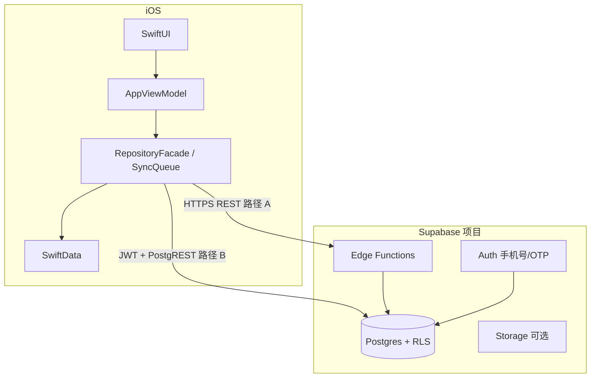

# Step 7 决策：Supabase + SwiftData 架构方案

> 对应计划：`docs/Audit-First-Execution-Plan.md` 的 Step 7  
> 目标：明确“为什么现在选 Supabase + SwiftData”，以及前置条件与风险。

---

## 1. 决策结论（先看）

结论：**可做，推荐采用 `Supabase（云） + SwiftData（本地）` 双层架构。**

前置条件：

1. 完成 Step 1-3 的存储边界和账号语义收口
2. token 迁移 Keychain
3. 明确同步冲突策略（以 `syncRevision + updatedAt` 为核心）

---

## 2. 为什么是这个组合

## 2.1 SwiftData（本地）

- 与 SwiftUI 生态一致，模型表达清晰
- 本地离线能力强，适合“记录型”产品
- 便于替代当前 `UserDefaults` 业务存储

## 2.2 Supabase（云）

- 自带 Auth、Postgres、Storage、Edge Functions，启动成本低
- 易于实现手机号登录、用户级数据隔离（RLS）
- 对单人开发者友好，能够快速形成可用后端基建

---

## 3. 目标架构（文本草图）

- 客户端层：
  - UI + ViewModel
  - Repository Facade
  - SwiftData 本地主存储
  - Sync Engine（增量上行/下行）
- 云端层（Supabase）：
  - Auth：手机号/OTP
  - Postgres：用户业务表（症状、对话、练习、同意等）
  - Storage：导出文件、报告快照附件（可选）
  - Edge Functions：受控 AI 中转、脱敏与审计

---

## 4. 与当前项目的衔接点

- 现有 `AuthTokenManager`、`RemoteJournalAPIClient`、`SyncQueue` 可演进，不需推倒重来
- `RepositoryFacade` 已具备“本地读优先 + 云端同步”方向
- 需重点补齐：
  - 真正可持久的本地数据库层（Step 2）
  - 统一同步协议字段（`syncStatus/syncRevision/serverID`）
  - 服务端 RLS 与审计表

---

## 5. 风险分析


| 风险   | 描述           | 应对                              |
| ---- | ------------ | ------------------------------- |
| 合规风险 | 医疗场景数据敏感     | 最小采集、字段分级、RLS、审计日志              |
| 离线冲突 | 多端编辑同一条记录    | `syncRevision + updatedAt` 冲突策略 |
| 成本风险 | 云资源与请求增长     | 先核心链路表，按模块渐进开通                  |
| 安全风险 | token/API 泄露 | Keychain + Edge Function 服务端持钥  |
| 演进风险 | 早期模型变更频繁     | 先冻结 v1 schema，再小步迁移             |


---

## 6. 同步策略（建议）

- 写路径：本地先写 -> 标记 `pendingUpload` -> 后台上传
- 读路径：本地主读 -> 云端增量下拉 -> 合并更新
- 冲突：优先高 `syncRevision`，同 revision 比较 `updatedAt`
- 删除：软删除（`deletedAt`），同步确认后再做本地物理清理

---

## 7. 不选其他方案的理由（本阶段）

- 纯云端实时直连：离线体验差，不适合记录型主场景
- Firebase 全家桶：可行，但与当前后端接口风格和 SQL 分析能力不如 Postgres 直观
- 完全自建后端：可控性高但单人阶段成本过高

---

## 8. 最小落地顺序（执行建议）

1. 建 SwiftData v1 schema 与迁移器
2. 建 Supabase Auth + 核心业务表 + RLS
3. 接通 Journal/Practice/Conversation 三条同步主链
4. 最后接报告聚合与导出流程

---

## 9. Step 7 验收结论

- 已明确“为何选择 Supabase + SwiftData”
- 已给出架构草图与同步策略
- 已列出风险与应对
- 已给出可执行前置条件与落地顺序

---

## 10. 与当前 iOS 客户端的契约对照（必须对齐）

以下路径与载荷以仓库内实现为准（`潮安/Data/Services/AuthAPIClient.swift`、`RemoteJournalAPIClient.swift`、`JournalDTO.swift`、`AppRuntimeEnvironment.swift`）。


| 能力         | 方法   | 路径                                | 说明                                                                                      |
| ---------- | ---- | --------------------------------- | --------------------------------------------------------------------------------------- |
| 手机号登录      | POST | `/api/v1/auth/phone/login`        | Body: `{ "phone": "<digits>" }`；响应: `AuthTokenPayload`（access/refresh/expiresIn/userID） |
| 刷新令牌       | POST | `/api/v1/auth/refresh`            | Body: `{ "refreshToken", "userId" }`；响应同登录                                              |
| Journal 拉取 | GET  | `/api/v1/journal/entries?userId=` | 响应: `[JournalEntryDTO]`                                                                 |
| Journal 推送 | PUT  | `/api/v1/journal/entries?userId=` | Body: `[JournalEntryDTO]`                                                               |
| 社区 Feed    | GET  | `/community/feed`                 | 响应结构同包内 `Resources/community_feed.json`                                                 |


**后端方案的第一条工程原则**：在 Supabase 落地时，要么（A）用 Edge Function / 轻量 BFF **保持上述 REST 契约不变**，客户端仅换 `baseURL`；要么（B）引入 **Supabase Swift SDK + PostgREST**，则需在单独里程碑中替换 `HTTPAuthAPIClient` / `HTTPRemoteJournalAPIClient` 的实现，并冻结 v2 契约文档。**推荐先 A 后 B**，降低单人团队并行改客户端与服务端的风险。

`RuntimeConfigResolver` 要求 **prod** 使用 HTTPS 且非 localhost；Staging/Prod 应分别对应独立 Supabase 项目（或同项目不同 schema，不推荐首版）。

---

## 11. Supabase 侧分层（推荐拓扑）




- **Auth**：用户主键与 RLS 中的 `user_id` 一致（见下节 `profiles`）。
- **Postgres**：业务真相源；**禁止**客户端使用 service_role key。
- **Edge Functions**：鉴权中继、AI 代理、Webhook、以及路径 A 下的 `/api/v1/`* 适配层。
- **Storage**（可选）：导出 PDF/归档、报告附件；元数据仍在表内。

---

## 12. Postgres v1 表草案（与 `JournalEntryDTO` + Step 2 同步字段对齐）

下列为**逻辑模型**，实施时在 Supabase SQL Editor 中建表；命名可用 snake_case，与 DTO 的 camelCase 由 API 层转换。

### 12.1 `profiles`（业务用户扩展，1:1 `auth.users`）


| 列                           | 类型          | 说明                                            |
| --------------------------- | ----------- | --------------------------------------------- |
| `id`                        | uuid PK     | `references auth.users(id) on delete cascade` |
| `phone_masked`              | text        | 可选                                            |
| `created_at` / `updated_at` | timestamptz | 默认 `now()`                                    |


触发器：用户首次登录后 upsert `profiles`，保证 RLS 可用 `auth.uid()`。

### 12.2 `journal_entries`

与当前 `JournalEntryDTO` 对齐，并加上 Step 2 软删与同步字段。


| 列            | 类型            | 说明                                                                     |
| ------------ | ------------- | ---------------------------------------------------------------------- |
| `id`         | text PK       | 与客户端 `JournalEntry.id`（UUID 字符串）一致，便于幂等 upsert                         |
| `user_id`    | uuid NOT NULL | `references profiles(id)`                                              |
| `date`       | text          | 保留现有 `date` 语义（日历日字符串）                                                 |
| `raw_text`   | text          |                                                                        |
| `created_at` | timestamptz   | 与 DTO `createdAt`（epoch ms/s）在 API 层约定一种精度（建议 ms bigint 或 timestamptz） |
| `revision`   | int           | 对应 DTO `revision`，冲突解决用                                                |
| `extracted`  | jsonb         | `ExtractedData` 整包序列化                                                  |
| `deleted_at` | timestamptz   | 软删除；同步删除语义见 §6                                                         |
| `updated_at` | timestamptz   | 服务端或触发器维护                                                              |


**索引**：`(user_id, updated_at desc)` 供增量同步；`where deleted_at is null` 部分索引可选。

### 12.3 其他表（与 `docs/Step2-SwiftData-Model-Design.md` 逐项落地）

按产品优先级分批建表，字段与本地 `Local`* SwiftData 模型保持一致：`consent_records`、`breathing_sessions`、`conversation_insights`（或拆为 `ai_conversations` + 子表）、`report_snapshots` 等。每一张表都带：`user_id`、`sync` 元数据（若仅服务端生成可简化）。

### 12.4 审计与合规（建议单独 schema 或前缀）

- `privacy_action_audit`：导出/删除/注销等（与客户端 `PrivacyActionAuditStore` 可上行聚合）
- `conversation_audit_redacted`：仅存储**已脱敏**摘要 + `risk_level` + `decision_path`（参考 Step 6），避免原始对话全文默认上云；若必须全量存储，需单独 DPIA 与留存策略。

---

## 13. RLS 策略（模板）

启用 RLS 后，典型模式：

```sql
-- 示例：journal_entries
alter table journal_entries enable row level security;

create policy "journal_select_own"
  on journal_entries for select
  using (auth.uid() = user_id);

create policy "journal_insert_own"
  on journal_entries for insert
  with check (auth.uid() = user_id);

create policy "journal_update_own"
  on journal_entries for update
  using (auth.uid() = user_id);
```

- **服务端批处理**（导出、运营统计）使用 **受限 service_role** 仅在 Edge Function 内、勿下发客户端。
- 社区官方内容若来自 CMS，可使用 `is_official = true` + 公开 `select` 策略，与用户生成内容区分。

---

## 14. 路径 A：REST 适配层（兼容现有客户端）

在 Edge Functions 中实现与 §10 相同的路径与 JSON：

1. `phone/login`：调用 Supabase Auth Admin API 或 OTP 流程，签发与现结构兼容的 token（短期可仍用自定义 JWT，长期应统一为 Supabase JWT）。
2. `auth/refresh`：刷新会话。
3. `journal/entries`：读写 `journal_entries`，`userId` query 必须与 JWT 内用户一致，否则 403。

**优点**：iOS 不改网络层即可接 Supabase。**缺点**：多一层维护；需在函数内严格校验 userId 防越权。

---

## 15. 路径 B：直连 Supabase（后续里程碑）

- 客户端使用 [Supabase Swift](https://github.com/supabase/supabase-swift)：`signInWithOTP`、`session` 刷新、`from("journal_entries").upsert()` 等。
- `AuthTokenManager` 演进为包装 Supabase `Session`；`userID` 使用 `auth.uid().uuidString` 或与现有 `phone_`* 映射表兼容（迁移期需双读）。

**切换条件建议**：SwiftData v1 稳定、Journal 冲突策略在 Staging 压测通过、法务确认字段分级与留存。

---

## 16. 同步与冲突（与 `SyncQueue` / `RepositoryFacade` 衔接）

- **上行**：本地 `pendingUpload` → PUT（路径 A）或 upsert（路径 B）→ 成功标 `synced` 并写 `last_synced_at`。
- **下行**：按 `updated_at`（或 `revision`）游标增量拉取；首次全量后改增量。
- **冲突**：与 §6 一致；若服务端 `revision` 更高，客户端拉取覆盖或合并（Journal 以「服务端 revision + 人工提示」为默认，避免静默丢字）。
- **删除**：仅软删同步；物理删除仅在用户「注销/清空数据」流程由客户端触发，服务端用 Edge Function 级联。

---

## 17. Edge Functions 清单（按优先级）


| 函数                   | 职责                             |
| -------------------- | ------------------------------ |
| `api_v1_auth` / 路由聚合 | 路径 A：登录、刷新                     |
| `api_v1_journal`     | 路径 A：Journal GET/PUT           |
| `ai_chat_proxy`      | 托管 API Key；脱敏、审计、限流（对齐 Step 6） |
| `export_generate`    | 异步生成导出文件，结果写 Storage + 表状态     |
| `webhooks`           | 支付/运营可选                        |


---

## 18. 成本、合规与运维（摘要）

- **成本**：Auth MAU、DB 存储、Egress、Edge 调用次数；Journal `extracted` jsonb 体积随用户增长，需监控单行大小与索引。
- **合规**：国内手机号与医疗健康信息：隐私政策中明示存储区域（Supabase 区域选型）、分包数据、最小必要字段；审计日志留存周期可配置。
- **运维**：Staging 固定 `chaoan_runtime_env=staging` + 独立 Supabase；生产密钥仅 CI / 密钥管理；参见 `ops/Production-Backend-Runbook.md`。

---

## 19. 执行清单（后端可勾选）

- 创建 Staging Supabase 项目，区域与法务结论一致
- 建 `profiles`、`journal_entries` + RLS + 索引
- 路径 A：部署 Edge Functions 对齐 §10 REST 契约，联调登录与 Journal
- 社区：`community_feed` 静态表或 Storage JSON + CDN，形状与 `community_feed.json` 一致
- Staging 全流程：`Release-Acceptance-Checklist` 中与后端相关项
- 文档化：service_role 与 anon key 使用范围、轮换流程

---

下一步：执行 Step 8（埋点事件字典）；后端与客户端并行时以本文件 §10–§19 为单一事实来源（SSOT）。